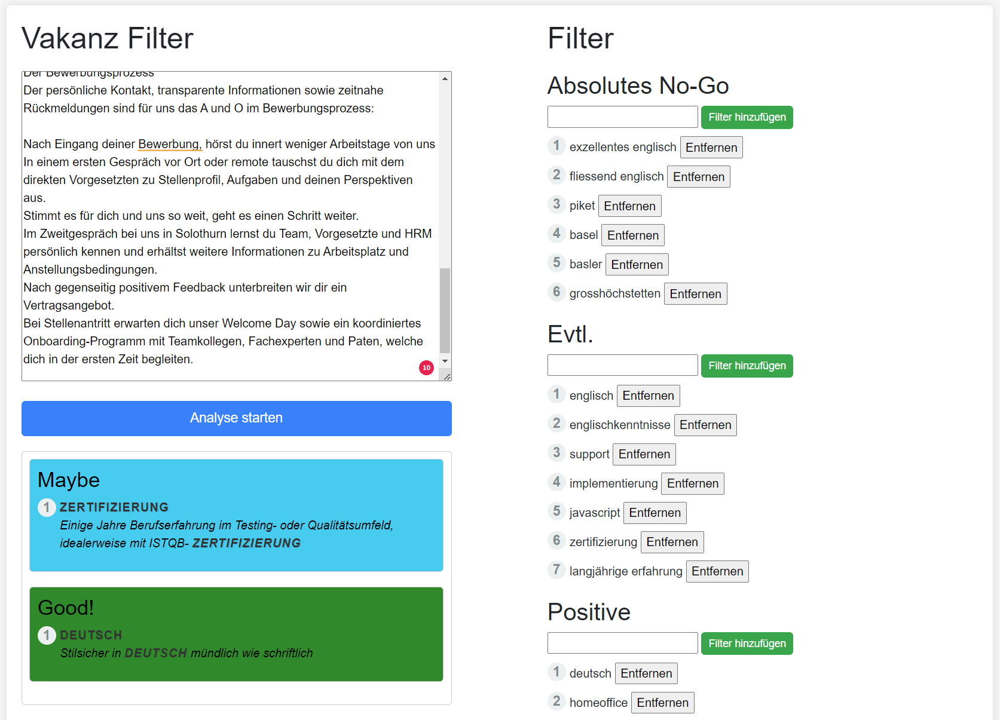

# Information 
## What is VakanzFilter?
VakanzFilter is a helpful tool that allows you to filter texts from job ads based on specific terms. This saves valuable time by clearly displaying only the relevant information.

## Current project status
Currently, this project serves only as a day-to-day helper and is not aimed at long-term development unless the community shows an interest in it. Due to its simplicity (It is an MVP version!), no Docker installation is currently possible. The user interface is currently only available in German.

## Installation
### Prerequisite
- Windows 10/11
- .NETcore 7.0 SDK
- VisualStudio/Rider/VSCode installed

### Execution
- Start your preferred IDE.
- Run a build in `release` mode.
- Copy the `.\VakanzFilter\bin\Release\net7.0\publish` folder to any location.
- Run the `VakanzFilter.exe` file.
- Open the following URL in your browser: `http://localhost:5000/`

# Usage
## Filters
On the right side of the interface you will find different categories for filters. Here you can add regex expressions as filters that will be used in the analysis.

## Analysis
On the left side you will find a field where you can paste the text of the job ad. Clicking Start Analysis starts the analysis and filters both the filter keywords and the context in which the keyword appears. The keywords found are then clearly displayed.

# Suggestions for improvement
- Enable persistence through a database
- Publish a Docker image to DockerHub
- Create separate views for filters and analysis
- Provide multilingual user interface

# Feedback
Do you find the app interesting and would you be interested in further development or should a bug occur, please create a new issue here on GitHub. We are happy to receive any feedback.